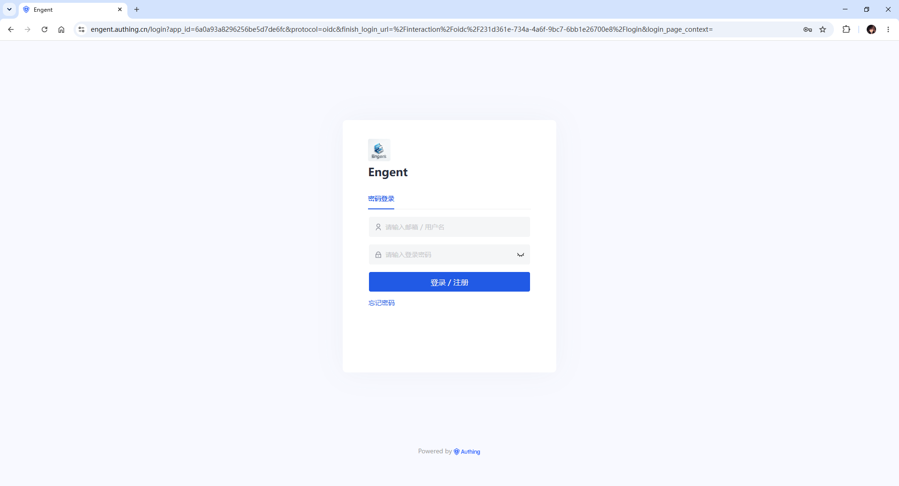
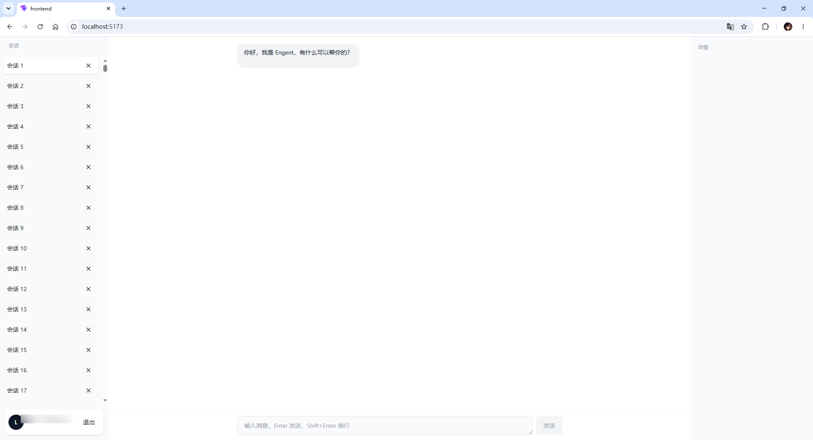

# Engent

个人项目 —— 一个基于 React 的 AI 聊天助手，支持用户认证、会话管理与实时对话，采用三栏响应式布局设计。

## 技术栈

| 类别 | 技术 |
|------|------|
| 框架 | React 18 + TypeScript |
| 构建工具 | Vite 8 |
| 样式 | Tailwind CSS 4 |
| 路由 | React Router DOM 7 |
| 用户认证 | Authing Guard (React 18) |
| 虚拟列表 | react-window |
| 代码规范 | ESLint + TypeScript ESLint |

## 项目结构

```
Engent/
├── backend/                       # 后端（待开发）
└── frontend/
    └── src/
        ├── components/
        │   ├── chat/              # 聊天相关组件
        │   │   ├── ChatInput.tsx      # 消息输入框（Enter 发送，Shift+Enter 换行）
        │   │   ├── MessageItem.tsx    # 单条消息气泡
        │   │   └── MessageList.tsx    # 消息列表（自动滚动到底部）
        │   ├── conversation/      # 会话管理组件
        │   │   ├── ConversationList.tsx  # 会话列表（react-window 虚拟滚动）
        │   │   └── ConversationRow.tsx   # 单条会话行
        │   ├── ui/
        │   │   └── Button.tsx         # 通用按钮组件
        │   ├── AppLayout.tsx          # 三栏布局（会话侧边栏 / 对话区 / 工具面板）
        │   └── AuthGuard.tsx          # 登录鉴权守卫组件
        ├── hooks/
        │   ├── useChat.ts             # 聊天逻辑 Hook（当前为 Mock，待后端接入）
        │   └── useConversations.ts    # 会话管理 Hook（支持 5 万条虚拟数据）
        ├── pages/
        │   ├── Callback.tsx           # Authing OAuth 回调页
        │   ├── ChatPage.tsx           # 主对话页面
        │   └── Login.tsx              # 登录页
        ├── router/
        │   └── index.tsx              # 路由配置
        ├── types/
        │   ├── chat.ts                # 消息类型定义
        │   └── conversation.ts        # 会话类型定义
        ├── App.tsx                    # 应用入口（GuardProvider 包裹）
        ├── main.tsx                   # React 挂载入口
        └── index.css                  # 全局样式（Tailwind CSS）
```

## 功能特性

- **用户认证**：集成 Authing Guard，支持 OAuth 登录、回调处理与登录状态守卫
- **会话管理**：左侧会话列表，使用 `react-window` 虚拟滚动，支持大规模数据（5 万条）流畅渲染
- **AI 对话**：聊天界面支持消息发送与加载状态展示（当前为 Mock，待后端接入）
- **响应式三栏布局**：
  - 桌面端：左侧会话列表 + 中间对话区 + 右侧工具面板
  - 移动端：抽屉式侧边栏，支持 ESC 键关闭
- **路由守卫**：未登录用户自动重定向至登录页

## 路由说明

| 路径 | 页面 | 说明 |
|------|------|------|
| `/login` | Login | 登录页 |
| `/callback` | Callback | Authing OAuth 回调页 |
| `/` | ChatPage | 主对话页（需登录） |

## 快速开始

### 环境要求

- Node.js >= 18

### 安装与运行

```bash
cd frontend
npm install
npm run dev
```

### 环境变量配置

在 `frontend/.env` 中配置 Authing 相关参数：

```env
VITE_AUTHING_APP_ID=your_authing_app_id
VITE_AUTHING_REDIRECT_URI=http://localhost:5173/callback
```

> 请前往 [Authing 控制台](https://console.authing.cn/) 创建应用并获取 `APP_ID`，同时将回调地址添加到应用的「登录回调 URL」中。

### 构建生产版本

```bash
npm run build
npm run preview
```

## 后续规划

- [ ] 接入后端 API，替换 Mock 数据
- [ ] Agent 编排与管理
- [ ] 工具面板功能完善
- [ ] 会话搜索与筛选
- [ ] 设置页面
