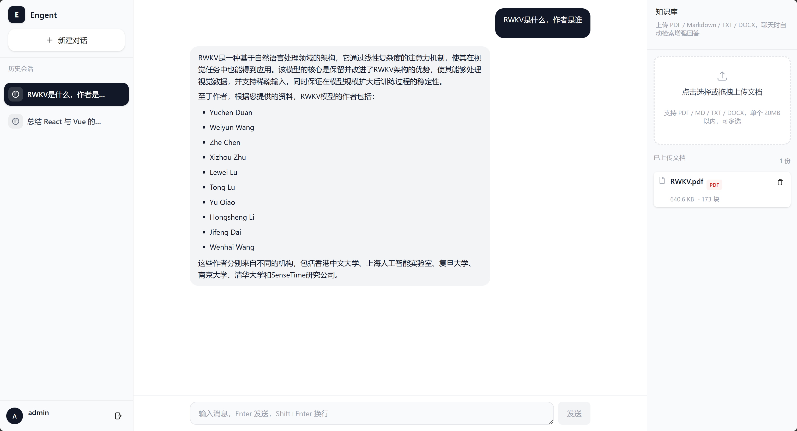
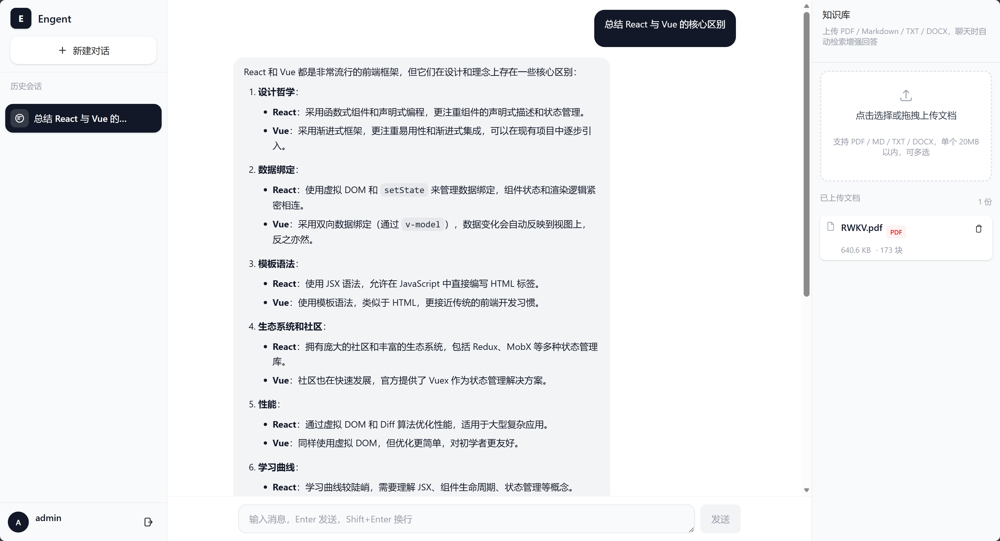

# Engent

个人项目 —— 一个基于 React + Express 的 AI 聊天助手，支持 Authing 用户认证、会话管理与 AI 对话，采用三栏响应式布局设计。

## 技术栈

| 类别 | 技术 |
|------|------|
| 前端框架 | React 18 + TypeScript |
| 构建工具 | Vite 8 |
| 样式 | Tailwind CSS 4 |
| 路由 | React Router DOM 7 |
| 用户认证 | Authing Guard (React 18) |
| 虚拟列表 | react-window |
| 后端框架 | Express + TypeScript |
| ORM / 数据库 | Sequelize + SQLite |
| AI 模型 | 智谱 GLM（glm-4.7-flash / glm-4.5-flash 自动回退） |
| 代码规范 | ESLint + TypeScript ESLint |

## 项目结构

```
Engent/
├── backend/                       # 后端（Express + Sequelize + SQLite）
│   ├── config/database.ts         # 数据库连接配置
│   └── src/
│       ├── controllers/           # 会话 / 消息控制器
│       ├── middleware/auth.ts     # Authing JWT 校验 + 本地用户自动建档
│       ├── models/                # User / Conversation / Message
│       ├── routes/                # REST 路由
│       └── services/llm.ts        # 智谱 GLM API 客户端（含模型自动回退）
└── frontend/
    └── src/
        ├── components/
        │   ├── chat/              # 聊天相关组件
        │   │   ├── ChatInput.tsx      # 消息输入框（Enter 发送，Shift+Enter 换行）
        │   │   ├── MessageItem.tsx    # 单条消息气泡
        │   │   └── MessageList.tsx    # 消息列表（自动滚动到底部）
        │   ├── conversation/      # 会话管理组件
        │   │   ├── ConversationList.tsx  # 会话列表（react-window 虚拟滚动）
        │   │   └── ConversationRow.tsx   # 单条会话行
        │   ├── ui/
        │   │   └── Button.tsx         # 通用按钮组件
        │   ├── AppLayout.tsx          # 三栏布局（会话侧边栏 / 对话区 / 工具面板）
        │   └── AuthGuard.tsx          # 登录鉴权守卫组件
        ├── context/               # 会话 Context（Provider + Hook 分离）
        ├── hooks/
        │   ├── useChat.ts             # 聊天逻辑 Hook（乐观更新 + 竞态防护）
        │   └── useConversations.ts    # 会话管理 Hook
        ├── pages/
        │   ├── Callback.tsx           # Authing OAuth 回调页
        │   ├── ChatPage.tsx           # 主对话页面
        │   └── Login.tsx              # 登录页
        ├── router/
        │   └── index.tsx              # 路由配置
        ├── types/
        │   ├── chat.ts                # 消息类型定义
        │   └── conversation.ts        # 会话类型定义
        ├── App.tsx                    # 应用入口（GuardProvider 包裹）
        ├── main.tsx                   # React 挂载入口
        └── index.css                  # 全局样式（Tailwind CSS）
```

## 功能特性

- **用户认证**：集成 Authing Guard，支持 OAuth 登录、回调处理与登录状态守卫；后端校验 JWT 并自动为首次登录用户建档
- **会话管理**：左侧会话列表，使用 `react-window` 虚拟滚动；会话与消息持久化至 SQLite，首条消息自动生成会话标题
- **AI 对话**：基于智谱 GLM 实现真实对话（非流式），发送时乐观更新 UI，主模型过载时自动回退备用模型
- **响应式三栏布局**：
  - 桌面端：左侧会话列表 + 中间对话区 + 右侧工具面板
  - 移动端：抽屉式侧边栏，支持 ESC 键关闭
- **路由守卫**：未登录用户自动重定向至登录页

## 路由说明

| 路径 | 页面 | 说明 |
|------|------|------|
| `/login` | Login | 登录页 |
| `/callback` | Callback | Authing OAuth 回调页 |
| `/` | ChatPage | 主对话页（需登录） |

## 快速开始

### 环境要求

- Node.js >= 18

### 1. 安装依赖

```bash
cd frontend && npm install
cd ../backend && npm install
```

### 2. 配置环境变量

前端 `frontend/.env` 配置 Authing：

```env
VITE_AUTHING_APP_ID=your_authing_app_id
VITE_AUTHING_REDIRECT_URI=http://localhost:5173/callback
```

> 请前往 [Authing 控制台](https://console.authing.cn/) 创建应用并获取 `APP_ID`，同时将回调地址添加到应用的「登录回调 URL」中。

后端 `backend/.env` 配置（参考 `backend/.env.example`）：

```env
# Authing 应用 JWKS 地址（Authing 控制台 → 应用配置中获取）
AUTHING_JWKS_URI=https://YOUR_DOMAIN.authing.cn/oidc/.well-known/jwks.json
# 智谱 GLM API Key（https://open.bigmodel.cn 控制台 → API Keys）
GLM_47_Flash_API_KEY=your_glm_api_key
# 可选：主/备用模型（默认 glm-4.7-flash / glm-4.5-flash，主模型过载自动回退）
# GLM_TEXT_MODEL=glm-4.7-flash
# GLM_FALLBACK_MODEL=glm-4.5-flash
```

### 3. 启动

```bash
# 后端（默认 http://localhost:3001）
cd backend && npm run dev

# 前端（默认 http://localhost:5173，已配置 /api 代理到后端）
cd frontend && npm run dev
```

### 构建生产版本

```bash
npm run build
npm run preview
```

## 后端 API

| 方法 | 路径 | 说明 |
|------|------|------|
| GET | `/api/conversations` | 当前用户的会话列表 |
| POST | `/api/conversations` | 创建会话 |
| DELETE | `/api/conversations/:id` | 删除会话（连同消息） |
| GET | `/api/conversations/:id/messages` | 会话消息列表 |
| POST | `/api/conversations/:id/messages` | 发送消息（后端调用 GLM 生成回复） |

除 `/health` 外，所有 `/api` 接口均需携带 `Authorization: Bearer <Authing token>`。

## 后续规划

- [x] 接入后端 API，替换 Mock 数据
- [ ] 流式输出（SSE）对话
- [ ] Agent 编排与管理
- [ ] 工具面板功能完善
- [ ] 会话搜索与筛选
- [ ] 设置页面
